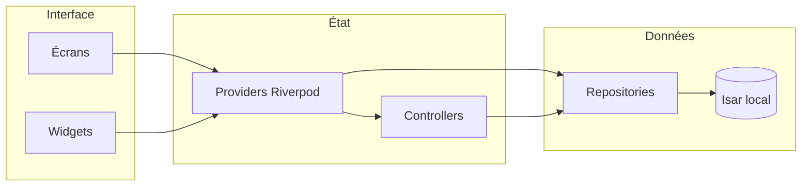
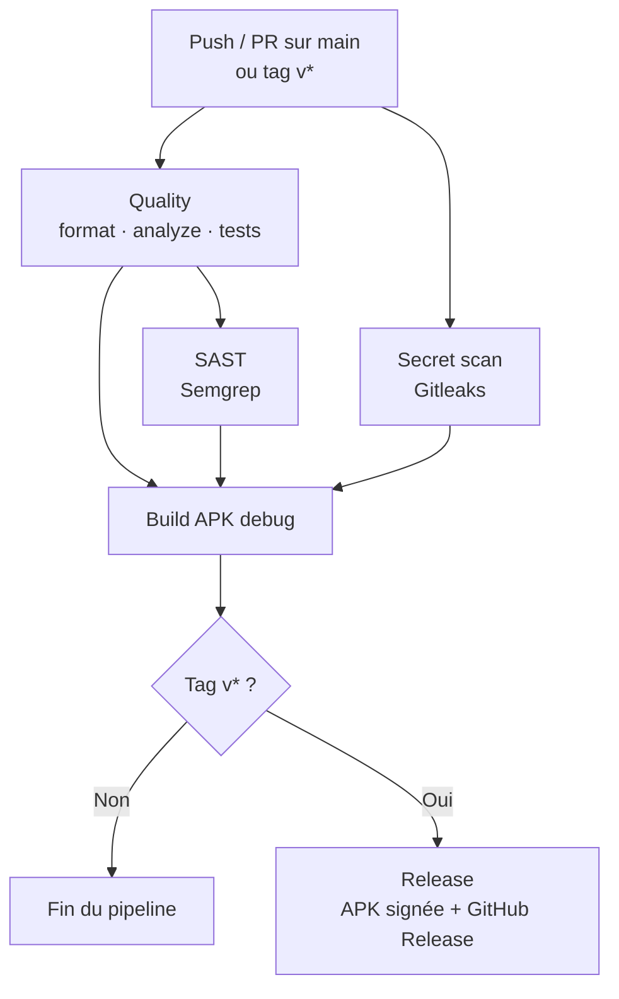

# Chronos

Application mobile Flutter de gestion du temps : tâches, habitudes, calendrier et statistiques.

Les données restent sur l’appareil (base locale Isar). Aucun compte ni serveur n’est requis.

## Fonctionnalités

- **Accueil** — aperçu du jour : salutation, mini-calendrier, tâches et habitudes
- **Tâches** — titre, description, date, horaires, catégorie, priorité, statut, couleur
- **Habitudes** — répétition sur les jours choisis, suivi quotidien
- **Calendrier** — vues jour, 3 jours, semaine, mois et kanban
- **Statistiques** — progression du jour, semaine et vue d’ensemble
- **Rappels** — notifications locales pour les tâches
- **Personnalisation** — thème clair/sombre, couleur principale, premier jour de la semaine
- **Tutoriel** — guidage au premier lancement

Navigation principale : Accueil, Calendrier, Stats, Réglages.

## Stack technique

| Techno | Rôle |
|--------|------|
| Flutter / Dart | Interface et logique de l’application |
| Riverpod | Gestion d’état |
| Isar (community) | Base de données locale, hors ligne |
| flutter_local_notifications | Rappels sur l’appareil |

Autres dépendances utiles : `intl` et `timezone` (dates), `permission_handler` (autorisations), `shared_preferences` (petits réglages).

## Architecture

Le code suit une séparation simple : **écran → état (Riverpod) → dépôt → base**.



```
lib/
├── main.dart                 Point d’entrée
├── database/                 Ouverture d’Isar
├── models/                   Entités persistées (tâche, habitude, etc.)
├── repositories/             Lecture / écriture en base
├── providers/                État exposé à l’UI (Riverpod)
├── controllers/              Actions métier (tâches, habitudes)
├── services/                 Init, notifications, thème, profil
├── views/                    Écrans
├── widgets/                  Composants réutilisables
└── utils/                    Dates, couleurs, validations
```

Les fichiers `*.g.dart` dans `models/` sont **générés** par Isar. Ne pas les modifier à la main.

## Prérequis

- [Flutter](https://docs.flutter.dev/get-started/install) 3.44.4 ou une version récente du canal stable
- SDK Dart compatible (`^3.12.2`, voir `pubspec.yaml`)

Vérifier l’installation :

```bash
flutter doctor
```

## Lancer le projet

```bash
git clone <url-du-depot>
cd chronos
flutter pub get
flutter run
```

Pour viser une plateforme précise : `flutter run -d android`, `-d ios`, `-d windows`, etc.

## Génération de code (Isar)

Après un changement dans un modèle annoté (`@collection`) :

```bash
dart run build_runner build --delete-conflicting-outputs
```

En continu pendant le développement :

```bash
dart run build_runner watch --delete-conflicting-outputs
```

## Qualité en local

```bash
dart format .
flutter analyze
flutter test
```

## CI / CD

Le pipeline GitHub Actions (`.github/workflows/ci.yml`) tourne sur chaque **push** et **pull request** vers `main`, et sur chaque **tag** `v*` (ex. `v1.0.0`).

Dependabot met aussi à jour chaque mois les dépendances Dart (`pubspec.yaml`) et les GitHub Actions.



| Étape | Rôle |
|-------|------|
| **Quality** | `dart format`, `flutter analyze`, `flutter test` |
| **Secret scan** | Gitleaks — détecte les secrets dans l’historique Git |
| **SAST** | Semgrep — analyse statique du code |
| **Build** | Compile une APK Android **debug** (après les contrôles ci-dessus) |
| **Release** | Uniquement si le commit est un tag `v*` : APK **release** signée, puis publication |

## Releases

Les versions publiques sont des [GitHub Releases](https://github.com/AmineIkhedji/Chronos/releases).

Pour publier une version :

1. Pousser un tag du type `v1.0.0` (le `v` est obligatoire).
2. Le job **Release** attend que qualité, scans et build debug passent.
3. L’APK Android est signée avec le keystore stocké dans les secrets GitHub (`KEYSTORE_BASE64`, `KEYSTORE_PASSWORD`, `KEY_ALIAS`, `KEY_PASSWORD`).
4. Une GitHub Release est créée avec l’APK jointe et des notes générées automatiquement.

L’APK se télécharge ensuite depuis la page Releases du dépôt.

## Modèle de données (aperçu)

| Entité | Contenu |
|--------|---------|
| Task | Titre, description, date, horaires, couleur, catégorie, priorité, statut |
| Habit | Titre, description, couleur, catégorie |
| Days | Jours de répétition d’une habitude |
| Notification | Rappel lié à une tâche |
| Category / Priority / Status | Listes de référence (valeurs par défaut au premier lancement) |
| Settings | Thème, couleurs, notifications, nom, premier jour de la semaine |

## Licence

Ce projet est sous licence [MIT](LICENSE). Vous pouvez l’utiliser, le modifier et le redistribuer, à condition de conserver la mention de copyright.
